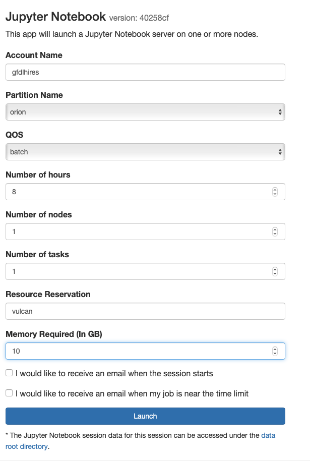

# Workshop on Domain-Specific Languages for Performance-Portable Weather and Climate Models

Material of the workshop held together with NOAA in 2020. All presentations are available in the [slides](https://github.com/VulcanClimateModeling/dsl_workshop/tree/main/slides) directory. Recordings of the sessions are available on [request](mailto:oliverf@vulcan.com).

## Setup Environment on Orion

1. ```ssh <user>@orion-login.hpc.msstate.edu``` (log on to Orion)
2. `git clone https://github.com/VulcanClimateModeling/dsl_workshop.git workshop` (check out the repository for the workshop)
3. Add the line `if [ -f ~/workshop/setup/jupyter_env ] ; then source ~/workshop/setup/jupyter_env ; fi` to the file `~/.bashrc` just **before** the line `if [ -z "$PS1" ]; then return; fi`
4. Make sure current `.bashrc` is active by typing `exec bash`
5. Go to workshop directory with `cd workshop`
6. `module purge` (remove any previously loaded modules)
7. `source ./setup/module_env` (load module environemnt for workshop)
8. Install GT4Py and setup Python virtual environment as Jupyter kernel with `./setup/setup_venv`

**Note:** If you ever log on to Orion to work interactively in a terminal, it's important you always repeat steps 6. and 7. in order to have the correct module environment loaded.

**Important:** At the end of the workshop you will want to remove the modification to your `~/.bashrc` again if you continue to use the Orion system.

## Setup Environment in Docker
1. run setup/docker_setup to build this image (slow)
2. run the run_docker.sh script to start up the notebook in a container, a link is provided for access

## Connect to Jupyter on Orion

1. Point your browser to https://orion-ood.hpc.msstate.edu/
2. Login
3. Click "Jupyter Notebook" under the "Interactive Apps" dropdown menu
4. Configure your session (Account Name = "gfdlhires", Partition Name = "orion", QOS = "batch", Resource Reservation = "vulcan") and launch you session. See image below.
5. Once the session has started, click "Connect to Jupyter"
6. The material for the workshop is under `workshop/notebooks`
7. Check you setup by executing the `Check-Setup.ipynb` notebook

## Jupyter Notebook App Setup


